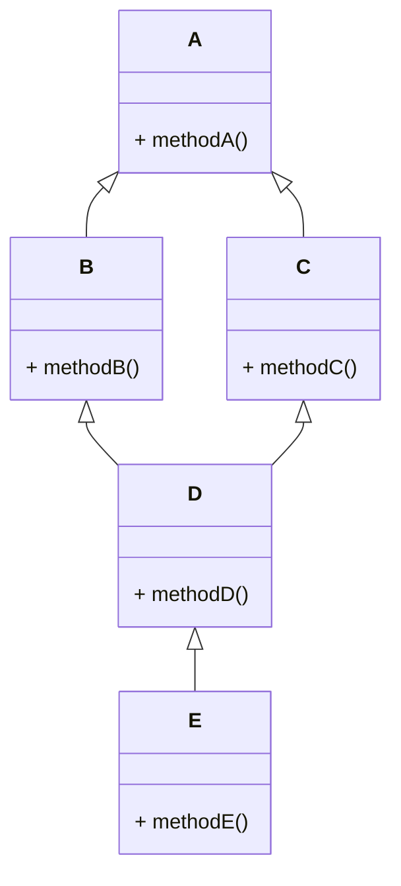

# 8.23

[TOC]


## 多继承的构造函数
- 派生类构造函数负责所有基类构造函数的调用；
- 派生类构造函数执行顺序
>执行所有基类的构造函数
>执行所有子类对象的构造函数
>执行派生类构造函数体

**处于同一层次的各基类构造函数的执行顺序取决于定义派生类时所指定的各基类顺序，与派生类构造函数中所定义的成员初始化列表中的各项顺序无关；**

### 二义性问题
- 产生二义性的原因：
	- 在多继承情况下，造成的对基类中某个成员的访问出现了不唯一的情况：
	- 主要表现为：对于不同基类中同名成员的访问，这种情况称为二义性问题，产生二义性原因是 ： 重名定义 多路径继承
- 重名定义解决方法：
	利用成员名限定法消除二义性
	在派生类中定义一个同名成员（彻底影藏）
	作用域限定二义性问题

### 多路径继承关系示例



- **可以看出 d 或 e 在继承时同时继承了 B和C，但他们同时是A的派生类，在他们进行构造函数时，会调用两次A的构造函数 D d.a不能确定是由b还是c调用的A中的a**
- 解决办法：
	- 作用域限定  d.B::a;          d.B::a;
	- 虚基类

## 虚基类(virtual base class) 

- 格式：`virtual <继承方式> <基类名> 关键字`

- 说明：
-  virtual与关键字public private的相对位置无关，但必须位于虚类名之前，且只对紧跟其后的基类名起作用

 

```c++
class D:virtual public A,private B,virtual public C
```


- 其中：类A和类C是虚基类，b不是

- 由于虚基类只有一个副本，因此其构造函数应只被调用一次，c++规定，虚基类的构造函数只有**最派生类（创建对象的类）**调用时才有效

  


### 虚基类的构造函数
- 虚基类的构造函数必须只被调用一次，目的是保证虚基类子对象只被初始化一次
- 虚基类子对象由最派生类的构造函数通过调用虚基类的构造函数进行初始化；
- 在一个成员的初始化列表中出现对虚基类和对非虚基类的构造函数调用时：**虚基类的构造函数先于非虚基类的构造函数的执行
- 最派生类的构造函数的成员初始化列表中必须给出对虚基类的构造函数的调用；如果未列出，则相应的虚基类必须有缺省的构造函数；

```c++
初始化顺序

    class 基类 {
        + 虚基类          存在多个基类时，执顺序取决于派生类定义时的顺序
        + 非虚基类
    }
    
    class 子对象 {
        存在多个子对象时，执行顺序取决于类中声明的顺序
    }
    
    class 数据成员 {
        + 一般数据成员
        + 常数据成员  成员初始化列表
        + 静态数据成员  类外初始化
    }


```


## 继承总结：

- 继承是面向对象程序设计的重要特征。
- 继承的定义中的继承方式决定了在派生类对象中基类成员的访问控制。
- 派生类成员可以与基类成员同名。可用域运算符::来区分和限定。
- **C++支持多继承。**
- 多继承有可能引起对基类成员访问的二义性。引起二义性的主要原因是重名定义，或是多路径继承。二者均可用域运算符::来区分和限定。
- **虚基类继承可以避免多路径继承二义性**。

## 多态
- 在面向对象语言中，接口的多种实现方式即为多态
- 多态性对软件功能的扩展和软件重用都有重要的作用
- 多态性： 发出同样的消息被不同类型的对象接收导致完全不同的行为

- 多态性表现为以下几种形式
	- 重载多态   调用相同名字的函数，表现出不同的行为，运算符的重载也是一种多态
	- 运行多态  通过基类的指针，调用不同派生类的同名函数，表现出不同的行为
	- 模版多态 也称为参数多态 通过一个模版，得到不同的函数或不同的类，在后续STL模版
### 多态的实现：联编(binding)
- 一个具有多态性的程序语句，在执行的时候，必须确定究竟是调用哪一个函数。也就是说，**在执行的时候调用哪个函数是唯一的确定的**，确定具有多态性的语句究竟调用哪个函数的过程称为联编（binding），有的资料也翻译成“绑定

- 联编有两种方式：静态联编和动态联编

  - 静态联编：在编译时就可以知道调用的是哪个函数，又称为编译时多态 主要靠**函数重载**和**操作符重载**实现
  - 动态的多态性是指在程序的运行时刻动态确定操作所指的对象，又称为运行时多态，主要靠**虚函数**实现

### 虚函数(virtual function)
- 说明方法：virtual<类型说明符><函数名>(<参数表>)
	- 在基类的函数的前面加上virtual关键字，那么所有的派生类都自动加上virtual关键字，故派生类的virtual关键字可以省略 
	- 优势：通过动态绑定可以使我们在编写程序时，使用继承层次中任意类型的对象，无须关心对象的具体类型，使用这些类的程序无须区分函数是在基类还是在派生类中定义的。

- 含义：
  - **若类中的一成员函数被说明为虚函数，则说明在其后续派生类中可能会对此成员函数进行不同的实现**，是对虚函数的重写
  - 

### 强制类型转换
强制类型转换
**static_cast**
用法：static_cast < type-id > ( expression )
q1. 为什么需要 static_cast 强制转换？

- void指针->其他类型指针 (不安全)
- 改变通常的标准转换
- 用于类层次结构中基类和子类之间指针或引用的转换。进行上行转换（把子类的指针或引用转换成基类表示）是安全的；进行下行转换（把基类指针或引用转换成子类指针或引用）时，由于没有动态类型检查，所以是不安全的。
**dynamic_cast**
用法：dynamic_cast < type-id > ( expression )
dynamic_cast 主要用于类层次间的上行转换和下行转换，还可以用于类之间的交叉转换（同一基类的两个同级派生类）。
在类层次间进行上行转换时，dynamic_cast和static_cast的效果是一样的；在进行下行转换时，dynamic_cast具有类型检查的功能，比static_cast更安全。
**reinpreter_cast**
它可以把一个指针转换成一个整数，也可以把一个整数转换成一个指针（先把一个指针转换成一个整数，在把该整数转换成原类型的指针，还可以得到原先的指针值）。
const_cast该运算符用来修改类型的 const 或 volatile 属性。除了 const  或 volatile 修饰之外， type_id 和 expression 的类型是一样的。
常量指针被转化成非常量指针，并且仍然指向原来的对象；常量引用被转换成非常量引用，并且仍然指向原来的对象；常量对象被转换成非常量对象。
**volatile 关键字**
- 使用方法：int volatile x;
- 作用：编译器不再优化。让编译器每次操作该变量时一定要从内存中真正取出，而不是使用已经存在寄存器中的值 。